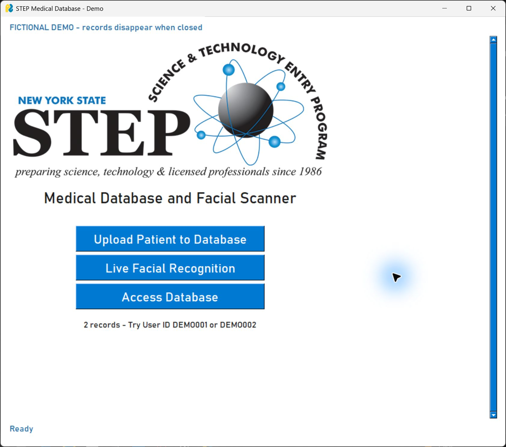
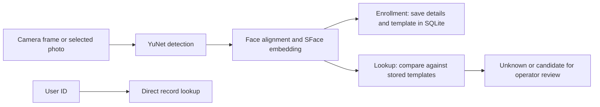

# STEP Medical Database and Facial Scanner

A Python desktop application exploring face-assisted patient record lookup. Built as a STEP science-fair project, it combines patient enrollment, live facial recognition, and a searchable local database in a PySimpleGUI interface.

The project focuses on connecting computer vision to a complete application workflow: capturing an image, generating a face template, associating it with a record, and retrieving a candidate for an operator to review. The current implementation uses OpenCV for recognition and SQLite for storage while retaining the original interface and STEP branding.

## Technology for all

This concept explores how accessible technology could support hospitals and clinics with limited budgets, particularly those serving lower-income and underrepresented communities. The design targets existing, lower-cost computers and affordable webcams. Recognition runs on the CPU without a dedicated graphics card or cloud server, although performance on lower-end hardware still needs to be evaluated.
After the initial installation and model downloads, enrollment, recognition, and record lookup work **without an internet connection**. Keeping processing and storage local reduces reliance on reliable connectivity and paid cloud infrastructure.
The goal is to help staff spend less time locating patient information so they can begin assessing and treating patients sooner. Affordability, offline access, and practical use guide the project's approach to making healthcare technology more accessible in settings with fewer resources.



**This is an educational prototype. Use fictional medical information and photos of yourself or consenting volunteers. It is not intended for clinical use or identity verification.**

## Features

- **Patient enrollment:** capture a webcam image or choose a photo, enter patient details, and save a record with a unique ID.
- **Face-assisted lookup:** compare a captured face against enrolled templates and review a candidate before opening its record.
- **Live recognition:** display candidate names or Unknown Person for each detected face.
- **ID lookup:** retrieve records without a webcam or recognition models.
- **Local storage:** save completed enrollments immediately and delete records together with their face templates.
- **Temporary demo:** explore fictional records in memory without creating a persistent patient database.

## Background

The original implementation used `face_recognition`, backed by dlib, to generate face encodings. Patient objects, names, and encodings were serialized into four pickle files. Matching a face returned a list position, which was then used to find the corresponding name and patient object. This required the lists to remain in the same order, and changes were written to disk when the application exited.

That design supported the science-fair concept with high accuracy, but tied the application to a particular library and set of files. Since it relied on dlib, its performance on Windows hardware was subpar compared to UNIX enviornments, mostly due to the need for an additional compiler. The current version separates the interface, storage, and recognition code, with explicit dependencies and a database that initializes on first launch.

| Component | Original implementation | Current implementation |
| --- | --- | --- |
| Interface | PySimpleGUI with fixed-size layouts | Same toolkit and screen sequence, with resizing and scrolling |
| Face recognition | `face_recognition` / dlib | OpenCV YuNet detection and SFace embeddings |
| Storage | Four pickle files containing related lists and objects | SQLite rows linking patient details and embeddings by ID |
| Saving | Serialize application state on exit | Commit each completed enrollment as a transaction |
| Camera | Device 1 opened at module import | Configurable device, opened on demand and released on navigation |
| Setup | Manually installed dependencies | Pinned packages and verified model downloads
Accuracy | Achieved 85% accuracy through independt testing with 25 sample faces       | Official testing has not been conducted yet since restructuring codebase   |
|
|


The [original source](archive/original_main.py) is preserved for reference. Historical patient files are not included, and the application does not import legacy pickle data. The original dlib embeddings cannot be used with SFace; existing subjects would need new face templates.

## Face recognition and storage

### Enrollment

YuNet detects the face and its landmarks. OpenCV aligns and crops the face, then SFace produces a **128-value embedding**: a learned numerical representation used to compare faces. Enrollment requires exactly one detected face.

The embedding stays in memory while the form is completed. On confirmation, the application validates the form and inserts the patient details and embedding into the same SQLite row:

| Field | Purpose |
| --- | --- |
| `id` | Unique patient ID and primary key |
| `details` | Patient information serialized as JSON |
| `embedding` | The 128-value face template serialized as a JSON array |
| `model` | Model identifier, currently `sface-2021dec` |
| `created_at` | Enrollment timestamp |

Saving both pieces in one transaction keeps the face template attached to its record. Canceling enrollment saves nothing. Deleting a record also removes its template from the active database.

Captured images are processed in memory rather than saved as photographs. A source photo selected from disk remains in its original location. The stored embedding is still biometric data.

### Lookup

A new capture follows the same detection, alignment, and encoding steps. The application loads enrolled templates from SQLite, and NumPy compares them using **cosine similarity**. The highest-scoring template supplies a candidate patient ID if it meets the threshold; otherwise, the face is unknown. The operator can review the candidate before opening the record. Each face in the live view is matched independently.



SQLite handles persistence and ID lookup; face comparisons run in memory. The default cosine threshold of `0.363` comes from the [OpenCV recognition example](https://docs.opencv.org/4.13.0/d0/dd4/tutorial_dnn_face.html). It has not been calibrated for this application, and similarity scores are not confidence percentages.

### Windows installation

The original recognition stack depended on dlib, which can require a C++ compiler and build tools when installed from source. Its Python wrapper, [`face_recognition`](https://pypi.org/project/face-recognition/), does not officially support Windows.

The current stack uses a [prebuilt OpenCV wheel](https://pypi.org/project/opencv-python/4.13.0.92/) for the supported Windows/Python environment. OpenCV's native code is already compiled, so installing the application does not require a local C++ compiler. YuNet and SFace are loaded from separately downloaded ONNX model files and run on the CPU.

This makes installation more reproducible. It does not establish a runtime speedup over dlib, which also executes compiled native code. No comparative performance benchmark is reported.

## Getting started

### Requirements

- Python 3.13, 64-bit, with tkinter. Windows setup commands use the Python launcher (`py`).
- A graphical desktop; a webcam is optional for ID lookup and photo import.
- Internet access to install dependencies and download recognition models. Processing runs locally after setup.

Python dependencies are pinned in [requirements.txt](requirements.txt): PySimpleGUI, OpenCV, and NumPy. SQLite support comes with Python. Windows is the locally tested platform.

### Install and run on Windows

From PowerShell in the project directory:

```powershell
py -3.13 -m venv .venv
.\.venv\Scripts\python.exe -m pip install -r requirements.txt
.\.venv\Scripts\python.exe scripts\download_models.py
.\.venv\Scripts\python.exe main.py --demo
```

Alternatively, run `./setup.ps1` to create the environment, install dependencies, download models, and run the startup check. If PowerShell blocks scripts, use the individual commands above.

The model downloader uses pinned upstream URLs and verifies file sizes and SHA-256 hashes before replacing local models. Model weights and virtual environments are excluded from Git.

On Linux or macOS, create an environment with Python 3.13 and use `.venv/bin/python` in place of `.venv\Scripts\python.exe`. A working tkinter installation is required.

### Demo mode

After installation, double-click **Run STEP Demo.cmd** or run `main.py --demo`. Select **Access Database**, enter `DEMO001` or `DEMO002`, and click **Submit**.

Demo records are fictional and have no face templates. To try face recognition, enroll yourself or a consenting volunteer with fictional form details. All demo records, including new enrollments, disappear when the application closes. Demo mode and ID lookup work without downloading the recognition models.

### Persistent mode

Double-click **Run STEP.cmd**, or run:

```powershell
.\.venv\Scripts\python.exe main.py
```

The database starts empty and persists between sessions. Use **Upload Patient to Database** to enroll a face and complete the form. Click **Confirm** to save, then note the displayed User ID. **Access Database** supports both ID and face lookup.

Camera index defaults to `0`. Select a different device with:

```powershell
.\.venv\Scripts\python.exe main.py --camera 1
```

Persistent storage defaults to:

| Platform | Database location |
| --- | --- |
| Windows | `%LOCALAPPDATA%\STEP\patients.sqlite3` |
| macOS | `~/Library/Application Support/STEP/patients.sqlite3` |
| Linux | `$XDG_DATA_HOME/STEP/patients.sqlite3`, or `~/.local/share/STEP/patients.sqlite3` |

Use `--data-dir PATH` to select another directory. Database files and personal images are excluded by `.gitignore`; avoid storing personal data in a cloud-synced directory.

## Testing

```powershell
.\.venv\Scripts\python.exe main.py --check
.\.venv\Scripts\python.exe -m unittest discover -s tests -v
.\.venv\Scripts\python.exe scripts\smoke_gui.py
```

- **Startup check:** reports dependency versions, verifies model hashes, and loads both models without opening a camera.
- **Regression tests:** cover storage consistency, validation, empty and unknown matches, independent face matches, camera failures, and blank-image rejection with the actual models.
- **GUI smoke check:** exercises lookup, enrollment, saving, deletion, and cancellation using fictional information and a synthetic embedding.

The [GitHub Actions workflow](.github/workflows/tests.yml) configures tests on Windows and Linux, with the GUI smoke check running under Xvfb on Linux. Functional tests do not measure recognition accuracy; matching across different captures, lighting conditions, and subjects requires separate evaluation.

## Limitations

Records and face templates are unencrypted. The application has no authentication, access control, audit trail, or liveness detection. A photograph can fool the matcher, and candidate matches can be incorrect. Performance across populations and capture conditions has not been independently evaluated.

Use fictional medical information for demonstrations. Deleting a database record does not remove imported source photos or external backups. The application is a local educational prototype, not a healthcare deployment or a security system.

## Troubleshooting

| Issue | Resolution |
| --- | --- |
| Missing Python modules | Install `requirements.txt` using the same virtual-environment interpreter used to launch the app. |
| Missing or invalid models | Run `scripts/download_models.py` with network access to GitHub. |
| Camera cannot open | Close other camera applications, check Windows camera permissions, or try `--camera 1`. |
| No face or multiple faces detected | Use a clear, well-lit image of exactly one consenting person. |
| Demo record does not match a face | The supplied fictional records have no templates. Enroll a face first. |
| Records disappear after closing | Use persistent mode rather than `--demo`. |
| Age validation fails | Leave age blank to calculate it from date of birth. |
| Content does not fit the window | Resize or maximize the window, or use the vertical scrollbar. |

## Project structure

```text
main.py                    Command-line entry point
step/app.py                PySimpleGUI interface and event handling
step/storage.py            Validation, SQLite storage, and demo records
step/recognition.py        Camera access, model loading, and face matching
scripts/download_models.py Model download and integrity checks
scripts/smoke_gui.py        GUI workflow checks
models/manifest.json       Model sources, revision, sizes, and hashes
tests/                     Core regression tests
archive/original_main.py   Original science-fair implementation
```

## Attribution and license

Third-party dependencies and models retain their own licenses; see [THIRD_PARTY.md](THIRD_PARTY.md). The STEP logo identifies the Science & Technology Entry Program and remains the property of its respective owner. Its inclusion reflects the project's original context and does not imply endorsement.

No reuse license is currently granted for the application code.
